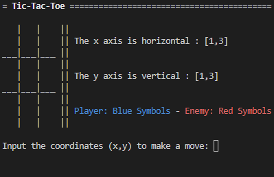

# :video_game: Games

This repository contains two simple games made in Python: tic-tac-toe and battleships. Each game has two versions: one made to be played only in the terminal window and another to be played with a graphical user interface. In the terminal version, the user inputs coordinates while on the graphical interface version the user clicks on the positions. The programs force the user to make a valid move, giving error messages each time the user makes an invalid move.

## Tic-Tac-Toe :hash:

The game Tic-Tac-Toe is pretty much self-explanatory as nearly all of us played it at some point. The user can choose whether they want to be X or O, going first if they choose X or latter if they choose O. The user plays against the machine and the player who succeeds in placing three of their marks in a horizontal, vertical or diagonal pattern is the winner.

### Terminal Version Screenshots:

   

## Battleships :ship:

The game Battleships works with a 10x5 map in which each tile may contain a hidden enemy. Once the player makes a correct move, a hint will be given: the game tells how many spaces away the nearest enemy is to the last valid position chosen. The game ends when either the player runs out of tries or all enemies are wiped out.

### Terminal Version Screenshots:

   

